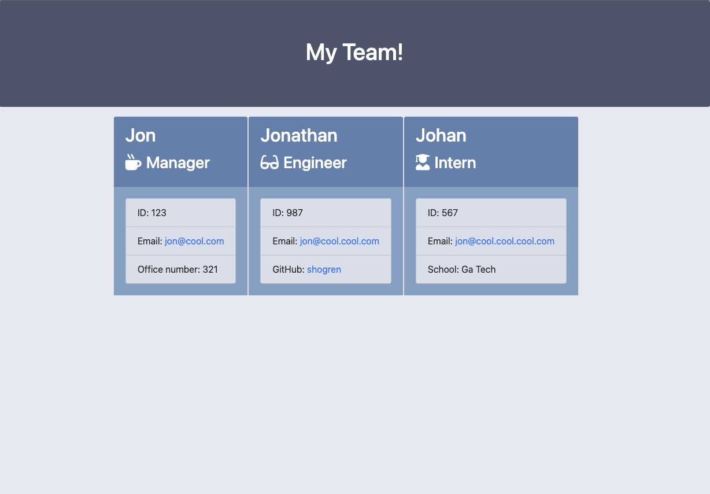

# 10-Team-Profile-Generator

## Description

This is the module 10 "Team Profile Generator" by Jonathan Shogren. The challange was to make a command line tool that builds a team profile site based on prompts to capture team information.

## User Story

```md
AS A manager
I WANT to generate a webpage that displays my team's basic info
SO THAT I have quick access to their emails and GitHub profiles
```

## Video Walkthrough

[Video Walkthrough](https://watch.screencastify.com/v/XFnaJ598L1ve99X3nbV5)

## Screenshot

Here is a screenshot of the finished site that was created with this tool:



## Additional Notes

* Uses the [Inquirer package](https://www.npmjs.com/package/inquirer) for user prompts.

* Uses the [Jest package](https://www.npmjs.com/package/jest) for unit tests.
